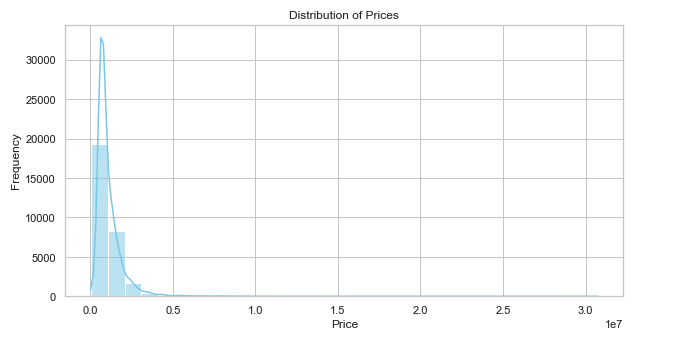
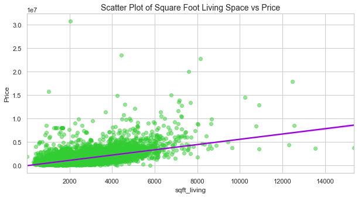
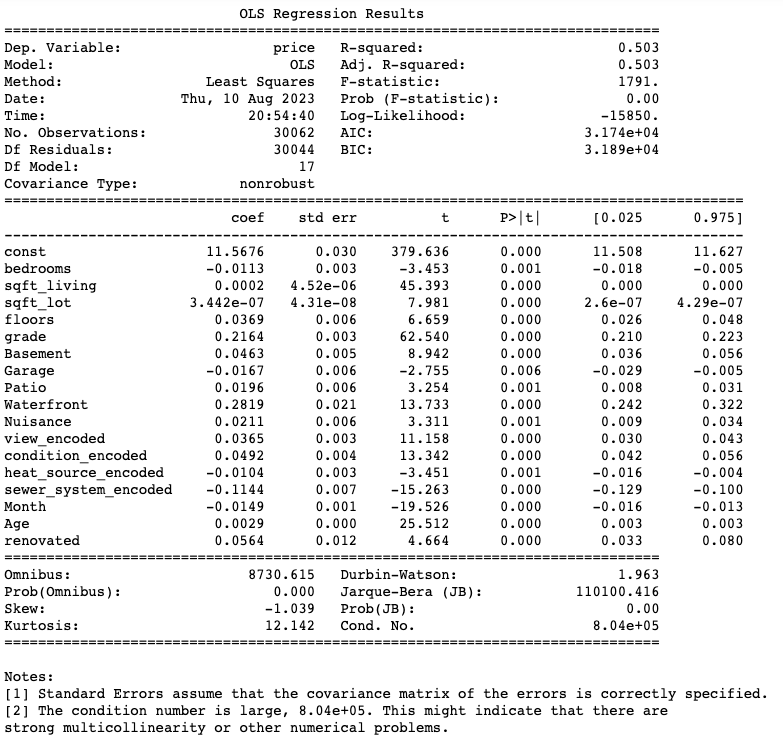
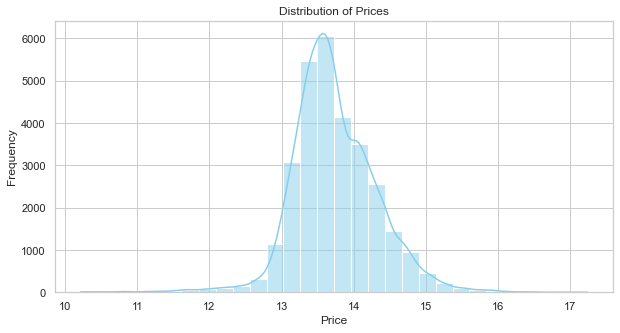

# King County Housing Prices: Phase2_Project

#### Project by: Lucas Wilkerson
#### Date: 8/7/2023

## Project Overview

Using housing price data from King County, I sought to explore what housing characteristics have the biggest infleunce on the price of a home in King County. Using linear regression, the aim is to take these housing characteristics and build a model to accurately predict housing prices based on these housing features. 

## Business Problem/Stakeholder

A real estate company in King County wants to increase customer acquisition and retention by providing transparent and useful information regarding the sales prices of homes. Utilizing this data, they can assist customers/clients that are looking to sell their home, understand what to expect to sell their current home for and what areas they could look into to increase the value of their home before selling. Utilziing our analysis and model, the goal is to help homeowners make informed decisions by assessing how factors like home condition, size (square footage) and other can impact their home's estimated value. Using this, homeowners can focus on the most important features to address in order to maximize their sale price. 

## Data Undertsanding 

For our analysis, we utilized the King County House Sales dataset. 
- kc_house_data.csv

Upon initial analysis, this dataset has 30,155 entries with a total of 25 columns (containing both numeric and object data) which represent the various features and characteristics of the homes along with the sale price. After data cleaning and preparation, which involved dropping missing values and duplicates, dropping unnecessary columns, and transforming certain columns, our clean working dataset now consists of 30,062 entries with 21 columns:

- Each row contains data of an individual house 
- The data in the columns represent the features/characteristics of the home. 
- After data preparation, all columns were adjusted to be numeric variables.

Final columns/features used include: 

- price: Sale price                 
- bedrooms: Number of Bedrooms            
- bathrooms: Number of Bathrooms           
- sqft_living: Square footage of living space           
- sqft_lot: Square footage of the lot              
- floors: Number of floors (levels) in house               
- grade: Overall grade of the house. Related to the construction and design of the house.                  
- sqft_above: Square footage of house apart from basement             
- Basement: Whether the house has a basement area      
- Garage: Whether the house has a garage area                 
- Patio: Whether the house has a patio area                  
- yr_built: Year when house was built               
- Waterfront: Whether the house is on a waterfront            
- Greenbelt: Whether the house is adjacent to a green belt              
- Nuisance: Whether the house has traffic noise or other recorded nuisances               
- view_encoded: Quality of view from house          
- condition_encoded: How good the overall condition of the house is. Related to maintenance of house.       
- heat_source_encoded: Heat source for the house    
- sewer_system_encoded: Sewer system for the house  
- month: Month the house was sold                   
- Age: Age (years) of the house when sold                  
- renovated: Whether the house has been renovated             

## Modeling 

Distribution of Sale Prices

Scatter plot showing relationship between Sale Price and Square Foot of Living Space

## Regression Results 

For regression, I ran a total of 6 models. The baseline model was built around one independent variable, sqft_living, and the dependent variable price. The initial R-Squared value was 0.375. Upong going through a total of 6 iterations, the final model showed the best performance with an R-Squared value of 0.503. 

The final model included 17 independent variables along with the dependent variable of price. Within this model, the price variable was log transformed to improve the results of the model. You can see by the distribution below, applying a log to price lead to a more normal distribution.

With the sixth model which happened to be the highest performing model, the R-squared value is 0.503, suggesting that approximately 50.3% of the variance in the log- transformed"price" variable can be explained by the independent variables in the model. The F-statistic is 1791, and the associated p-value (Prob (F-statistic)) is very close to zero (0.00) which indicates that the model is statistically significant and performs better than a model with no predictors.

- Looking at Sqft_living, for every increase of 1 sqft of living space in a home, the average price increases by about 0.0002 in the natual log of the price.
- Looking at overall condition, if condition rating improves by 1 (unit) categories/ levels up one rating on overall condition, we see an associated increase of about 0.0492 in the natural log of price

The log transformed model has an MAE of 0.2872 and MSE of 0.4099.
- With a MAE of 0.2872, it means that, on average, the predicted log-transformed values deviate from the actual log-transformed values by approximately 0.2872 units.
- With a MSE of 0.4099, this means that, on average, the squared differences between predicted and actual log-transformed values result in an average squared error of approximately 0.4099 units.

## Conclusion/ Recommendations 

After analysis of the data and regression models, the final model (model 6) suggests that the main features in increasing a home's price per unit are grade and if the house is waterfront or not. When looking at grade, this refers to the construction quality of the house which includes the types of materials used and the quality of the workmanship. Buildings with higher grade typically cost more to build and typically command a higher value. Now changing the waterfront feature is not practically feasible so this would not be a viable feature to really focus on for individuals looking to sale their current home, but is something to keep in mind if their home is waterfront. So with that said, let's look at the features that would be feasible to change to increase the value of the home:

- Overall Condition: I recommend homeowners consider the condition of their home. Making small needed repairs and resolving any maintenance issues can increase the value of their home. If the condition rating improves by one category/ levels up one rating on overall condition, there is an associated increase of about 4.92% in average price.

- Square Feet of Living Space: I recommend homeowners also focus on increasing the overall square footage of living space. For each 1 square foot increase, there is a 0.02% increase in average price. If that is scaled out to an increase of 1000 sqaure feet, then the math calculates out to an approximate 20% increase in average home price.

- Grade: If homeowners are planning to increase square footage and additional construction is needed, then consider hiring a high quality contractor and invest in high quality materials so that the grade level can be optimized. For each increase in grade level, there is an associated increase of ~ 21.6% in average price.

## Limitations

While the model is useful to getting a representation of which features are impactful when it comes to price, the model does have its limitations. 

- The final R-Squared value is 0.503 which suggests that approximately 50.3% of the variance in the log- transformed "price" variable can be explained by the independent variables in the model. Ideally we would want this to be higher. 

- There are other variables and factors of influnece that could be explored in further detail such as location and time of year sold. Considerations in these areas could be zipcode of homes, proximity in the state and which month is more ideal for selling a home. 

## Repository Structure

├── Images                                                                                                                       
├── .gitignore                                                                                                                   
├── Home_Price_Final_Notebook.ipynb                                                                                             
├── KC_Housing_Prices_Presentation_Slides.pdf                                                                                   
└── README.md                                                                                                                    